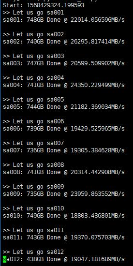

# AutoRclone: rclone copy/move/sync (automatically) with service accounts (still in the beta stage)
Many thanks for [rclone](https://rclone.org/) and [folderclone](https://github.com/Spazzlo/folderclone).

- [x] create service accounts using script
- [x] add massive service accounts into rclone config file
- [x] add massive service accounts into groups for your organization
- [x] automatically switch accounts when rclone copy/move/sync 
- [x] Windows system supported

Step 1. Copy code to your VPS or local machine
---------------------------------
_Before everything, install python3. Because we use python as our programing language._

**For Linux system**: Install
[screen](https://www.interserver.net/tips/kb/using-screen-to-attach-and-detach-console-sessions/),
`git` 
and [latest rclone](https://rclone.org/downloads/#script-download-and-install). 
If in Debian/Ubuntu, directly use this command
```
sudo apt-get install screen git && curl https://rclone.org/install.sh | sudo bash
```
After all requirements above are successfully installed, run this command
```
sudo git clone https://github.com/xyou365/AutoRclone && cd AutoRclone && sudo pip3 install -r requirements.txt
```
**For Windows system**: Directly download this project then [install latest rclone](https://rclone.org/downloads/). 
Then run this command (type in cmd command windows or PowerShell windows) in our project folder
```
pip3 install -r requirements.txt
```

Step 2. Generate service accounts
---------------------------------
Let us create as many service accounts as possible following steps
of [official steps of folderclone](https://github.com/Spazzlo/folderclone). (**Note**: With new version of folderclone, you can skip our **Step 4** directly)

After you finished, there will be many json files in one folder named `accounts`. 

Just copy all json files into our folder `accounts`.

[What is service account](https://cloud.google.com/iam/docs/service-accounts)

[How to use service account in rclone](https://rclone.org/drive/#service-account-support).


Step 3. Add service accounts to Google Groups (Optional)
---------------------------------
_Support that you are GSuite admin (domain admin or normal admin)_

Here we use Google Groups to manager our service accounts considering the  
[Official limits to the members of Team Drive](https://support.google.com/a/answer/7338880?hl=en) (Limit for individuals and groups directly added as members: 600).

1. Turn on the Directory API following [official steps](https://developers.google.com/admin-sdk/directory/v1/quickstart/python) (save the generated json file to folder `credentials`).

2. Create groups for your organization [in the Admin console](https://support.google.com/a/answer/33343?hl=en). After create a group, you will have an address for example`sa@yourdomain.com`.

3. Run `python3 massadd.py -p ./accounts -c credentials/*.json -g sa@yourdomain.com`

_For meaning of above flags, please run `python3 massadd.py -h`_

Step 4. Add service accounts or Google Groups into Team Drive
---------------------------------
_If you do not use Team Drive, just skip._

Add the group address `sa@yourdomain.com` to your source Team Drive (tdsrc) and destination Team Drive (tddst). 
 
If you are not Gsuite admin or do not care about the member limitation of Team Drive, 
just use script of `folderclone` to add `sa` accounts into Team Drive.

- Add service accounts into your source Team Drive:
`python3 masshare.py -d SharedTeamDriveSrcID`

- Add service accounts into your destination Team Drive:
`python3 masshare.py -d SharedTeamDriveDstID`

Step 5. Start your task
---------------------------------
Let us `rclone copy` hundreds of TB resource using service accounts.

* For remote operation
- [x] publicly shared folder to Team Drive ([Existing bug](https://forum.rclone.org/t/rclone-cannot-see-all-files-folder-in-public-shared-folder/12351))
- [x] Team Drive to Team Drive
- [x] publicly shared folder to publicly shared folder (with write privilege)
- [x] Team Drive to publicly shared folder
```
python3 rclone_sa_magic.py -s SourceID -d DestinationID -dp DestinationPathName -b 1 -e 400
```
_For meaning of above flags, please run python3 rclone_sa_magic.py -h_

* For local to Google Drive (need test)
- [ ] local to Team Drive
- [ ] local to private folder
- [ ] private folder to any (think service accounts cannot do anything about private folder)
```
python3 rclone_sa_magic.py -sp YourLocalPath -d DestinationID -dp DestinationPathName -b 1 -e 400
```

* Run this command `tail -f log_rclone.txt` to see what happens in details (linux only).



Let's talk about this project in Telegram Group [AutoRclone](https://t.me/AutoRclone)

[Blog（中文）](https://www.gfan.loan/?p=235) | [Google Drive Group](https://t.me/google_drive) | [Google Drive Channel](https://t.me/gdurl)  


